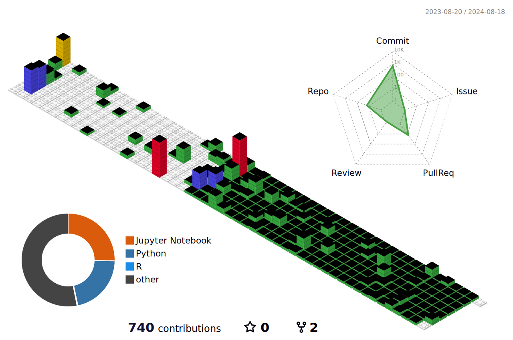

<!-- Header banner -->

 

 
    
<!-- Title Typing Effect -->

 

### Hi there 🖐️ 

I'm Jieun Kim, dreaming of becoming an **AI Engineer, AI Researcher**.  
Especially interested in **Computer Vision & Multi-Modal**.  
And, I am going to graduate from Kookmin University in 2025 with a major in AI Big Data & Management, and minor is S.W.  

&nbsp;
&nbsp;
&nbsp;

<h3 align="center"> ☎️ Contact ☎️ </h3>      

  

    
    
      

 

&nbsp;
&nbsp;

<h3 align="center">  ⚔️ Technical Skills ⚔️ </h3>  

#### Languages & Development Tools

  </a>&nbsp 
  &nbsp
  </a>&nbsp
  &nbsp
  </a>&nbsp
  &nbsp
  </a>&nbsp  
   
  </a>&nbsp
  &nbsp
  &nbsp
  </a>&nbsp
   
  </a>&nbsp 
  </a>&nbsp
  </a>&nbsp
  </a>&nbsp 
  </a>&nbsp
   
  &nbsp
  &nbsp
  </a>&nbsp
  </a>&nbsp 
  </a>&nbsp 
  </a>&nbsp

&nbsp;

<h3 align="center"> 💼 Work 💼 </h3>  

| 활동기간 | 직장명 | 부서명 | 비고 |
| :------: | :------: | :------: | :------: |
| 2024.03 ~ | (주)위드마인드 | AI/Data 개발팀 | 인턴 |

&nbsp;

<h3 align="center"> 💡 Career 💡 </h3>  

| 활동기간 | 기관 | 명칭 | 비고 |
| :------: | :------: | :------: | :------: |
| 2018.03 ~ 2021.02 | 서울 금옥여자고등학교 | 인문계열 | 졸업 | 
| 2021.03 ~ | 국민대학교 | AI빅데이터융합경영학과 | 제1전공 |
| 2022.03 ~ | 국민대학교 | 소프트웨어융합전공 | 부전공 |
| 2021.03 ~ 2021.12 | 중앙동아리 밴드 아우성 | 동아리원 | - |
| 2021.03 ~ 2022.12 | 축구 소모임 BAS | 매니저 | - |
| 2021.03 ~ 2021.08 | 빅데이터경영통계전공 학생회 제8대 CODE | 총무부원 | - |
| 2021.06 ~ 2021.08 | 예비 직무 전문가 양성 과정 Junior CoREP | 7기 선발 | 수료 |
| 2021.06 ~ 2021.07 | 빅데이터경영통계전공 감사위원회 | 감사위원장 | - |
| 2021.12 ~ 2022.12 | AI빅데이터융합경영학과 학생회 제1대 AI:M |  부학생회장 | - |
| 2022.03 ~ 2022.12 | 밴드 소모임 인지밴드 1기 | 설립자 | - |
| 2022.03 ~ 2022.12 |  빅데이터분석학회 제9대 D&A | 학회원 | 수료 |
| 2022.12 ~ 2023.02 | AI빅데이터융합경영학과 제1대 비상대책위원회 | 복지부장 | - |
| 2023.07 ~ 2023.09 | LG Aimers 3기 | 수강생 | 수료 |
| 2023.07 ~ 2023.09 | DACON DACrew 6기 | 데이크루 6기 | 수료 |
| 2023.03 ~ 2023.12 | AI빅데이터융합경영학과 교수지원실 | 근로장학생 | - |
| 2023.03 ~ 2023.12 |  인공지능학회 제4대 X:AI | 학회원 | 수료 |
| 2022.12 ~ 2023.12 |  빅데이터분석학회 제10대 D&A | 학회 운영진 | - |
| 2023.08 ~ | 국민대학교 | 학부연구생 | 진행중 |
| 2023.08 ~ 2024.01 | 인공지능 및 빅데이터 분석 커뮤니티 Kaggle Korea Study | 2023 하반기 선발 | - |
| 2023.12 ~ | 인공지능학회 제5대 X:AI | 학회장 | - |
| 2024.01 ~ | 인공지능 및 빅데이터 대표 연합 동아리 TOBIG's | 21기 선발 | - |

&nbsp;

<h3 align="center"> 📚 Paper review 📚 </h3>  

| 분야 | 비고 | 링크 |
| :------: |  :---: | :---: |
|Deep Learning|논문 리뷰|[LINK](https://j2u.notion.site/Paper-Review-d3d26d9997264a0f989f69bca26fe321?pvs=4)|

&nbsp;

<h3 align="center"> 👩‍🏫 Deep Learning Projects 👩‍🏫 </h3>  

|주관|대회(프로젝트)명|분야|기간|비고|
|:--:|:-----:|:---:|:-----------:|:--:|
|[전공] 딥러닝|Real-Time 해양침적폐기물 수거 모델 개발|CV|2023.05~2023.06|[LINK](https://github.com/Ji-eun-Kim/Development-of-Marine-Deposition-Waste-Collection-Model-Using-Real-Time-Object-Detection.git)|
|[전공] 텍스트데이터분석|Word Cloud와 LDA를 통한 주요 시사 별 특징 파악 - 정치, 기술, 경제, 환경을 중심으로|NLP|2023.05~2023.06|[LINK](https://github.com/Ji-eun-Kim/Text-Data-Analytics)|
|[인공지능 학회] X:AI|이미지 내 문구 번역 및 원본 스타일 적용|Multi-Modal|2023.07~2023.08|[LINK](https://github.com/Ji-eun-Kim/Translate-phrases-in-images-and-apply-original-styles.git)|
|[빅데이터분석학회] D&A|사용자 맞춤형 3D 신발 커스텀 제작 : Style Transfer and 3D Reconstruction|CV|2023.08~2023.11|[LINK](https://github.com/Ji-eun-Kim/3D_Customized_Shoes)|
|[전공] 비전AI와비지니스|Object Detection을 활용한 자동차 운전자 이상행동탐지|CV|2023.11~2023.12|[LINK](https://github.com/Ji-eun-Kim/Driver-anomaly-Detection-System-using-Object-Detection)|
|[교내] 학부연구생|[가제] Golf&Tennis : Swing Motion Similarity Analysis Based on Time series & 3D Pose estimation|CV|2023.08~ |-|
|(주)위드마인드|-|LLM|2024.03~|-|
|(주)위드마인드|-|Multi-Modal|2024.03~|-|

&nbsp;

<h3 align="center"> 👨‍🏫 Analysis & ML Projects 👨‍🏫 </h3>  

|주관|대회(프로젝트)명|분야|기간|비고|
|:--:|:-----:|:---:|:-----------:|:--:|
|[전공] 빅데이터처리와시각화|따릉이 대여량에 따른 성북구 따릉이 이용 최적화 제안|데이터 분석|2022.05~2022.06|[LINK](https://github.com/Ji-eun-Kim/Big-Data-Processing-n-Visualization)|
|[빅데이터분석학회] D&A|서울특별시 자치구별 학구열 분석 및 인사이트 도출|데이터 분석 및 시각화|2022.05~2022.06|[LINK](https://github.com/Ji-eun-Kim/DnA-Visualization-competition)|
|[전공] 회귀분석|행복결정요인 분석 - 수면과 월평균 가구총소득 중심으로|회귀분석|2022.05~2022.06|[LINK](https://github.com/Ji-eun-Kim/Analysis-of-the-determinants-of-happiness.git)|
|[전공] 공간빅데이터분석|홍대 및 연남 상권 생존 맛집 분석|QGIS|2022.05~2022.06|[LINK](https://github.com/Ji-eun-Kim/Spatial-BigData-Analysis)|
|[전공] 머신러닝|인사 정보 데이터 기반 연봉 예측 모델링 대회|ML|2022.10~2022.11|[LINK](https://github.com/Ji-eun-Kim/ML-competition-in-kaggle)|
|[빅데이터분석학회] D&A|신용카드 사용자 연체 예측 AI 경진대회|ML|2022.10~2022.11|[LINK](https://github.com/Ji-eun-Kim/DnA-ML-competition)|

&nbsp;

<h3 align="center"> 🥇 Competition 🥇 </h3>   

|주최 및 주관|대회(프로젝트)명|분야|순위(기타)|비고|기간|링크|
|:------:|:---:|:---:|:---:|:----:|:---:|:---:|
|[(주)피플앤커리어그룹/경력개발지원단]|저학년 예비 직무 전문가 양성 과정 Junior CoREP 7기	|직무 로드맵 팀 공모전|대상   (1위)|총장상|2021.06~2021.08|[LINK](https://j2u.notion.site/Junior-CoREP-7-041fadd7004e4eda8ca16fe8d4d94563?pvs=4)|
|[통계청/한국통계진흥원]|2022년 통계데이터 분석·활용대회|데이터 분석|-|-|2022.07~2022.08|[LINK](https://github.com/Ji-eun-Kim/Statistical-Data-Analysis-N-Utilization-Competition)|
|[(사)한국빅데이터학회/후원: CJ제일제당]|2023 BDA 데이터 분석·활용 공모전|ML(분류)|입선|-|2023.05~2023.06|[LINK](https://github.com/Ji-eun-Kim/CJ-themarket-modeling-competition)|
|[DACON]|데이크루 6기|ML(회귀)|우수상   (2위)|-|2023.07~2023.08|[LINK](https://github.com/Ji-eun-Kim/DACrew_6th/blob/main/README.md)|  
|[과학기술정보통신부/NIA 한국지능정보사회진흥원]|제11회 2023 빅콘테스트 정형데이터분석분야 어드밴스드리그|ML(회귀)|최우수상   (2위)|예술의전당사장상|2023.08~2023.11|[LINK](https://github.com/Ji-eun-Kim/2023_BigContest)|

&nbsp;

<h3 align="center"> 📕 Study 📕  </h3>  

| 공부 내용 | 기간 | 비고 | 링크 |
| :------: | :---: | :---: | :---: |
|파이썬 스터디|22.01~22.02|파이썬 기초|[LINK](https://j2rooong.tistory.com/category/%EC%96%B8%EC%96%B4/Python%20%EA%B8%B0%EC%B4%88)|
|D&A Basic Session|22.03~22.06|데이터 분석|[LINK](https://github.com/Ji-eun-Kim/DnA-session/tree/main/Basic-Session(%EA%B3%BC%EC%A0%9C%EC%A0%9C%EC%B6%9C))|
|머신러닝 스터디|22.07~22.08|머신러닝 기초|[LINK](https://github.com/Ji-eun-Kim/Machine-learning-study)|
|D&A ML Session|22.09~22.12|머신러닝|[LINK](https://github.com/Ji-eun-Kim/DnA-session/tree/main/ML-Session(%EA%B3%BC%EC%A0%9C%EC%A0%9C%EC%B6%9C))|
|딥러닝 스터디|22.12~23.02|딥러닝 기초|[LINK](https://j2rooong.tistory.com/category/Deep%20Learning/2023%20DL%20%EA%B8%B0%EC%B4%88%20%EC%9D%B4%EB%A1%A0%20%EA%B3%B5%EB%B6%80)|
|알고리즘 문제 풀이|23.03~ing|알고리즘|[LINK](https://github.com/Ji-eun-Kim/Coding_test)|
|D&A Basic Session|23.03~23.06|파이썬 기초/데이터 분석   (학회운영진-멘토)|[LINK](https://github.com/Ji-eun-Kim/DnA-session/tree/main/Basic-Session(mento))|
|X:AI Base Session|23.03~23.06|딥러닝   (논문 리뷰)|[LINK](https://j2u.notion.site/Paper-Review-d3d26d9997264a0f989f69bca26fe321?pvs=4)|
|D&A DL Session|23.03~23.06|딥러닝   (학회운영진-멘토)|[LINK](https://github.com/Ji-eun-Kim/DnA-session/tree/main/Deep-Session(mento))|
|X:AI Adv Session|23.07~23.08|딥러닝   (Toy project)|[LINK](https://github.com/Ji-eun-Kim/Toy_project)|
|D&A ML Session|23.09~23.12|머신러닝   (학회운영진-멘토)|[LINK](https://github.com/Ji-eun-Kim/DnA-session/tree/main/ML-session(mento))|
|DL Model Architecture 구현|24.01~|Pytorch Deep Learning 코드 구현| [LINK](https://github.com/X-AI-eXtension-Artificial-Intelligence/5th-Operation-study) |
|TOBIG's DL Study|24.01~24.03|심층 학습 이론서 스터디 및 발표| [LINK](-) |
|LLM의 모든 것|24.03~|LangChain/RAG| [LINK](-) |
|환경 구축|24.03~|Linux/Docker| [LINK](-) |

&nbsp;

<h3 align="center"> 🪪 License 🪪  </h3>   

  

|취득 연도|자격증|관할기관|유효기간|
|-|-|-|-|
|2023|ADsP|한국데이터산업진흥원|영구|

&nbsp;

<h3 align="center"> 👩‍💻 Algorithm Stats 👩‍💻 </h3>   

  

&nbsp;

&nbsp;

<h3 align="center"> (●'◡'●) J2's Git TMI (●'◡'●) </h3>   

  

  

<!-- My profile -->
<!--  -->
<!--  -->
  
  
  

   

&nbsp;

<!-- Hit counter -->

&nbsp;

 

    
<!-- Footer banner -->

